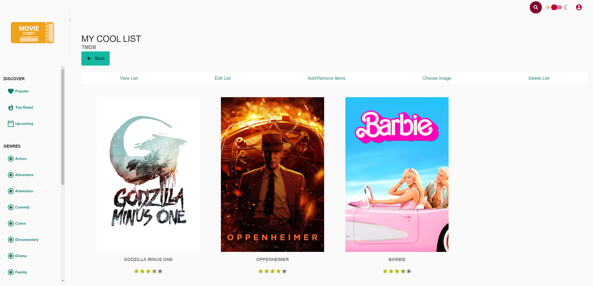

# resilient-backend-service

## 🚀 Run

### Backend

```bash
cd backend
./gradlew bootRun
```

> OpenAPI Specification can be found under http://localhost:8080/swagger-ui/index.html
>
> Select the `TMDBv4` definition to test out the list feature!

> Use environment `spring.profiles.active=datagen` to perform simple data generation

Unit & Integration Tests can be run via

```bash
./gradlew test
```

Resilience Tests can be run via

```bash
./gradlew resilienceTest
```

### Frontend

> Based on [angular-movies](https://github.com/tastejs/angular-movies/tree/2fb531a51da71875bc188ebb754cacffeb080f68)
> from https://tastejs.com/movies/

> ⚠️ Requires [`nx`](https://nx.dev/getting-started/installation#installing-nx-globally)
>
> ```bash
> npm install --global nx@latest
> ```

```bash
cd frontend
npm install
npm run start
```



## 🧑‍💻 Architecture

Our application is underpinned by a Spring Boot backend, structured using a package-by-feature approach. This
methodology ensures our architecture remains both organized and scalable, facilitating easy updates and maintenance.

The backbone of our service is the comprehensive API from "The Movie Database" (`tmdb`). We've integrated both the v3
and v4 OpenAPI Specifications (OAS) from `tmdb`, accessible for
reference [here](https://developer.themoviedb.org/openapi). The integration with these APIs is streamlined through the
use of springdoc, which manages our OAS/Swagger definitions.

In our architectural narrative, we play the role of a proxy, channeling all API calls from our backend to `tmdb`, with a
special twist on the list feature. We recognize `tmdb` as an external API that, while generally reliable, occasionally
presents challenges that require resilient solutions. Our custom list feature stands out by offering robust CRUD (Create, Read,
Update, Delete) operations, bolstered with thorough input validation.

In essence, our architecture is designed not just for efficiency and reliability, but also for adaptability, ensuring a
smooth and responsive experience for users and developers alike.

### Clean Code Considerations

* **Single Responsibility Principle**: Each class has a specific role, such as DTOs for data transfer, entities for domain models, repositories for data access, services for business logic, and controllers for request handling. For instance, `MovieListDTO` deals strictly with the data transfer object structure for movie lists.
* **Open/Closed Principle**: The use of interfaces for services and repositories indicates an intent to make components extendable without modification. For example, `MovieListService` could be implemented by different concrete classes without changing the clients that depend on the interface.
* **Liskov Substitution Principle**: The clear interface definitions suggest that any implementation can be substituted without affecting the correctness of the program.
* **Interface Segregation Principle**: The segregation into various interfaces like `MediaDataRepository` and `MovieListRepository` means that clients will not be forced to depend on interfaces they do not use.
* **Dependency Inversion Principle**: Dependency inversion is practiced through the use of constructor injection, which is preferred over field injection (e.g., with the `@Autowired` annotation). This allows for more testable and maintainable code, as dependencies are more explicit and mapped fields can utilize the `final` modifier.

Other notable clean coding practices include:

- **Package by Feature**: The organization of the project  into packages by feature simplifies navigation and enhances modularity.  This structure allows developers to easily locate and work on different  aspects of the application without cross-contaminating concerns, leading to a more intuitive and maintainable codebase.
- **Layered architecture**: Each layer knows only about its layer or the one below it, ensuring a separation of concerns.
- **Data Transfer Objects (DTOs)**: Used for all API interactions, separating internal entities from what is exposed through the API.
- **Validation**: Leveraging Spring's validation mechanism, which provides a declarative way to add validation logic.
- **Exception handling**: Utilizing resilience patterns with libraries like Resilience4j and custom methods like `catchValidationAndNotFoundEx` to handle exceptions that should not be further propagated to Resilience4j fallbacks like `ConstraintViolationExceptions`.

### Resilience4J Circuit Breaker Configuration for TMDB Proxy Endpoints

#### Configuration Values:

- `failure-rate-threshold=50`: This value indicates that the circuit breaker will open if 50% of requests fail in the
  rolling window. The choice of 50% is a balanced threshold that allows for some failures (due to the unpredictability
  of external API responses) without being too lenient.

- `minimum-number-of-calls=15`: This means that at least 15 calls must be made before the circuit breaker can calculate
  the failure rate. This ensures that the circuit breaker doesn't make decisions on too small a sample size, which could
  lead to premature or unnecessary opening.

- `wait-duration-in-open-state=16s`: Once opened, the circuit breaker will stay open for 16 seconds. This duration gives
  the TMDB API enough time to potentially recover from any transient issues.

- `permitted-number-of-calls-in-half-open-state=3`: When transitioning from open to half-open, we allow 3 calls to pass
  through. This is to test if the external service has recovered without overwhelming it with traffic.

- `sliding-window-size=100`: We use a sliding window of 100 calls to calculate the failure rate. This size provides a
  broad enough sample for an accurate assessment of the service’s health.

- `sliding-window-type=count_based`: This configuration bases the sliding window on the number of calls rather than
  time, ensuring that the failure rate calculation is based on actual usage patterns.

#### Rationale:

These settings are specifically tailored for the `tmdbApi` and `tmdbImage` endpoints of our application, which interact
with external TMDB services. Given the nature of external APIs, where occasional failures and slow responses can be
expected due to various factors (like network issues, service downtimes, etc.), the chosen configuration aims to provide
a resilient system without being overly strict.

- The `failure-rate-threshold` and `minimum-number-of-calls` provide a balance between responsiveness and stability,
  ensuring that the circuit breaker only opens when there's a consistent pattern of failures, rather than occasional
  glitches.

- The `wait-duration-in-open-state` is set to give enough time for the TMDB API to recover, considering the average
  response times and known behaviors of this service.

- The `permitted-number-of-calls-in-half-open-state` and `sliding-window-size` are chosen to provide enough data points
  for making informed decisions about the state of the circuit without being too restrictive or too lenient.

In conclusion, these settings are designed to ensure that our application gracefully handles failures in external
services while maintaining a high availability and user satisfaction.

### Resilience4J Rate Limiter Configuration for TMDB Proxy Endpoints

#### Configuration Values:

- `limit-for-period=50`: This setting restricts the number of calls to the TMDB API to 50 per time period. It is
  designed to prevent rate limit errors from the external TMDB service and ensure fair usage of the API.

- `limit-refresh-period=1s`: This period indicates that our rate limit will reset every second. This short refresh
  period allows a high throughput of requests while still protecting against sudden bursts that might overwhelm the TMDB
  API or violate its rate limiting policies.

- `timeout-duration=0ms`: This setting means that our system will not wait if the rate limit has been reached; it will
  immediately fail the request. This is to ensure quick feedback to the client in case of high load, rather than queuing
  and delaying the requests.

- `allow-health-indicator-to-fail=true`: This allows the health indicator to mark the rate limiter as 'DOWN' in the
  application's health check if it is not functioning as expected, providing transparency in system monitoring.

- `subscribe-for-events=true`: This enables subscription to rate limiter events, which can be useful for monitoring,
  logging, or alerting purposes.

- `event-consumer-buffer-size=50`: This defines the buffer size for storing rate limiter events, ensuring that event
  data is available for a sufficient number of recent requests for effective monitoring and analysis.

#### Rationale:

The chosen configuration is based on the operational characteristics and requirements of the `tmdbApi` and `tmdbImage`
endpoints. The TMDB API, like many external APIs, imposes rate limits to manage traffic and ensure service availability
for all consumers. Our rate limiter settings are tailored to work within these constraints while maximizing our
application's access to the TMDB API.

- The `limit-for-period` and `limit-refresh-period` provide a balance that allows a high frequency of requests (up to 50
  requests per second) without exceeding the TMDB API's rate limits. This setting is particularly important for
  endpoints that are expected to handle a high volume of requests, such as image fetching or frequent data lookups.

- The `timeout-duration` of 0ms ensures that the application remains responsive, even under high load, by quickly
  rejecting requests that would exceed the rate limit, instead of queueing them.

- Enabling health indicators and event subscriptions enhances the observability of the rate limiter's performance,
  allowing for timely adjustments or interventions if the rate limiting behavior affects the user experience or API
  accessibility negatively.

In summary, this rate limiter configuration is intended to create a sustainable and efficient interaction with the TMDB
API, balancing the need for high availability and responsiveness with the constraints imposed by external API rate
limits.

### Resilience4J Retry Configuration for TMDB Proxy Endpoints

#### Configuration Values:

- `max-attempts=3`: This setting specifies that the system should attempt a failed request up to a maximum of three
  times. This number is chosen to balance between giving enough chances for a transient error to resolve and avoiding
  excessive retries that may lead to longer response times.

- `wait-duration=1s`: Between each retry attempt, the system will wait for 1 second. This delay is intended to provide a
  brief buffer which might allow for any temporary issues (like brief network interruptions) at the TMDB API's end to
  resolve themselves before the next attempt.

#### Rationale:

The retry mechanism is crucial for enhancing the robustness of the `tmdbApi` and `tmdbImage` endpoints, especially
considering the dependency on the external TMDB API, which might occasionally face transient issues like network
glitches or short-lived downtime.

- **Number of Attempts (`max-attempts`)**: Three attempts are a standard choice in many applications, providing a
  reasonable number of retries without overwhelming the server or delaying the response excessively for the client.

- **Wait Duration (`wait-duration`)**: A 1-second pause between retries is a typical choice to balance immediacy and
  patience. It's long enough to allow many temporary issues to be resolved but not so long that it causes unacceptable
  delays for the end-users.

This configuration aims to improve the reliability of communication with the TMDB API, ensuring that short-term failures
do not unduly impact the user experience. By retrying failed requests a limited number of times with a reasonable wait,
we can handle many common errors gracefully.

### Resilience4J Time Limiter Configuration for List Endpoints

#### Configuration Values:

- `timeout-duration=3s`: This setting defines a maximum time limit of 3 seconds for the response from the two TMDB List
  endpoints. If the response time exceeds 3 seconds, the time limiter will trigger a timeout exception.

- `cancel-running-future=true`: This configuration ensures that if the timeout is exceeded, the ongoing operation (i.e.,
  the `CompletionStage` or `CompletableFuture` task) is canceled. This helps in preventing the accumulation of stalled
  or slow tasks.

#### Rationale:

The time limiter is particularly useful for operations where timely responses are crucial, and delays beyond a certain
threshold are unacceptable. For the `/tmdb/4/account/{account_id}/lists` and `/tmdb/4/list` endpoints, timely response
is critical to maintain a good user experience and to ensure the system's responsiveness. The specific choice of 3
seconds for the `timeout-duration` strikes a balance between allowing enough time for typical requests to complete and
avoiding excessive waiting times for end-users in case of slow responses.

By integrating the time limiter with the circuit breaker and retry mechanisms, we ensure a robust strategy where:

1. **Time Sensitivity**: Operations are time-bound, preventing long waits in case of slow responses.
2. **Error Handling**: The integration with the circuit breaker allows the system to handle scenarios where repeated
   timeouts might indicate a deeper issue with the underlying service.
3. **Recovery Attempt**: Coupled with retry logic, the system can attempt to recover from transient issues that may
   cause temporary delays.

In summary, the time limiter's configuration for these endpoints is tailored to enhance the system's reliability and
user experience by ensuring operations do not exceed a reasonable time frame, thereby managing potential delays
effectively.

### Resilience4J Circuit Breaker and Retry Configuration for List Endpoints

Both of these configurations are very similar to the Resilience4j Circuit Breaker and Retry patterns used for the Proxy
Endpoints for the same reasons.
